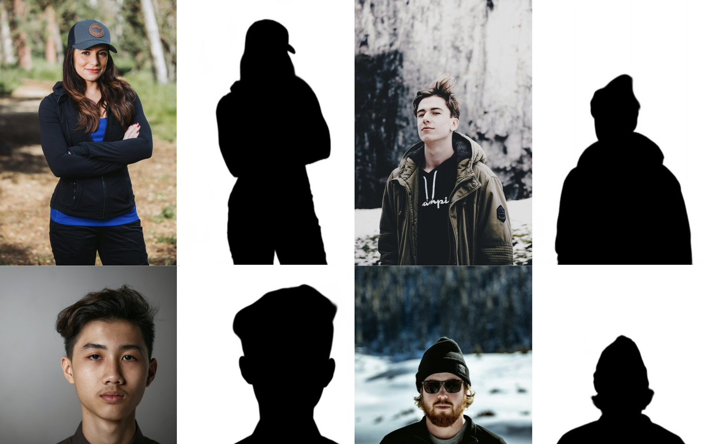
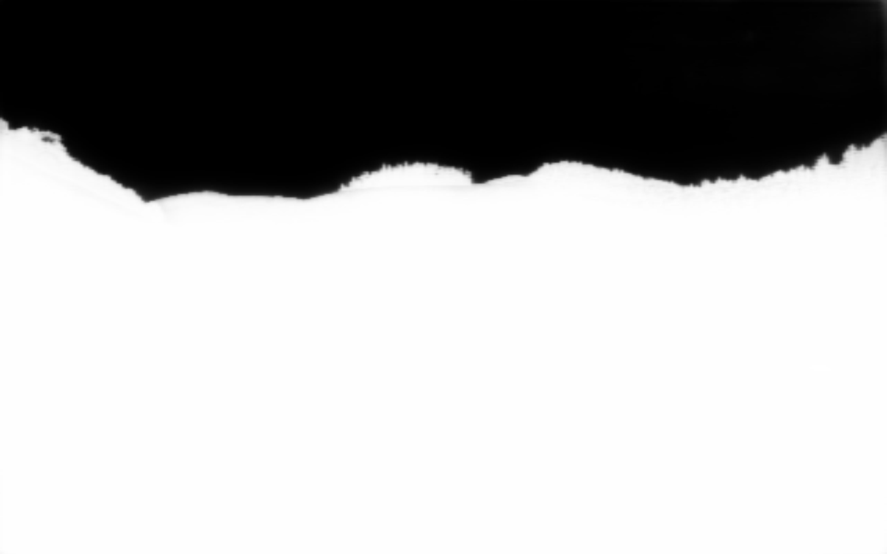

# U<sup>2</sup>-Net on tinygrad

This repository contains the [tinygrad](https://github.com/tinygrad/tinygrad)-ported version of the [U<sup>2</sup>-Net](https://github.com/xuebinqin/U-2-Net/tree/master) model.

## Setup

```sh
pip3 install -r requirements.txt
```

## Download weights

The repo contains the small models' weights in [weights](./weights/) folder.
The large (176 mb) weights can be downloaded from the following links:  

[foreground segmentation](https://drive.google.com/file/d/1m_Kgs91b21gayc2XLW0ou8yugAIadWVP/view?usp=sharing)  

[portrait model](https://drive.google.com/file/d/1IG3HdpcRiDoWNookbncQjeaPN28t90yW/view?usp=sharing)

## Run inference

```sh
python3 u2net_run.py -i /path/to/image -m selected_model
```

Where `selected_model` is one of:  

`fg`: human segmentation (large variant, 176 mb)  

`fg_small`: human segmentation (small variant, 4.7 mb)  

`sky_small`: sky segmentation (small variant, 4.7 mb)  

`portrait`: converts photo to pencil drawing (only large variant available, 176 mb)

## Examples

Foreground segmentation



Sky segmentation




## License

Apache-2.0 license
